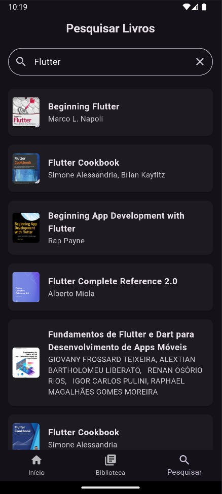

# Codexia

## Descrição
Codexia é um aplicativo de gerenciamento de lista de leitura desenvolvido em Flutter. Ele permite aos usuários pesquisar livros utilizando a API do Google Books, adicionar títulos a uma lista de leitura pessoal e gerenciar essa lista através de uma interface intuitiva e amigável.

## Funcionalidades Principais
- Pesquisa de livros utilizando a API do Google Books
- Adição de livros à lista de leitura pessoal
- Remoção de livros da lista de leitura
- Visualização detalhada das informações dos livros
- Armazenamento local da lista de leitura utilizando SQLite

## Tecnologias Utilizadas
- Flutter SDK 3.24.3
- Dart 3.5.3
- SQLite para armazenamento local
- API do Google Books
- Pacote `dotenv` para gerenciamento seguro de chaves de API
- Android Studio "Ladybug" 2024 (IDE)
- OpenJDK 17

## Instalação e Configuração

### Pré-requisitos
- Flutter SDK (última versão)
- Dart SDK
- Android Studio ou VS Code
- Git

### Passos para Instalação

1. Clone o repositório:
   ```
   git clone https://github.com/seu-usuario/google-books-tracker.git
   ```

2. Navegue até o diretório do projeto:
   ```
   cd google-books-tracker
   ```

3. Instale as dependências:
   ```
   flutter pub get
   ```

4. Configure o arquivo `.env`:
    - Crie um arquivo `.env` na raiz do projeto
    - Adicione sua chave da API do Google Books:
      ```
      API_KEY=sua_chave_api_aqui
      ```

5. Execute o aplicativo:
   ```
   flutter run
   ```

## Como Usar

1. **Pesquisar Livros**:
    - Na tela inicial, toque no ícone de pesquisa
    - Digite o título ou autor do livro desejado
    - Pressione enter ou toque no botão de pesquisa

2. **Adicionar à Lista de Leitura**:
    - Nos resultados da pesquisa, toque no livro desejado
    - Na tela de detalhes, toque no botão "Adicionar à Lista de Leitura"

3. **Visualizar Lista de Leitura**:
    - Na tela inicial, toque no ícone de biblioteca
    - Veja todos os livros adicionados à sua lista

4. **Remover da Lista de Leitura**:
    - Na tela da lista de leitura, deslize o livro para a esquerda
    - Toque no ícone de lixeira para remover

## Estrutura do Projeto

```
google-books-tracker/
│
├── lib/
│   ├── models/
│   │   └── book.dart
│   ├── screens/
│   │   ├── book_details_screen.dart
│   │   ├── library_screen.dart
│   │   ├── main_screen.dart
│   │   └── search_screen.dart
│   ├── services/
│   │   ├── database_helper.dart
│   │   ├── google_books_service.dart
│   │   └── library_service.dart
│   ├── global_wrapper.dart
│   ├── main.dart
│   └── my_app.dart
│
├── .env
├── .gitignore
├── analysis_options.yaml
├── pubspec.yaml
└── README.md
```

## Capturas de Tela
<div style="display: flex; justify-content: center; gap: 40px; margin-top: 20px;">
  
  
  
</div>

<p style="text-align: center; margin-top: 10px;">
  Legenda: Tela Inicial (esquerda), Biblioteca (centro), Pesquisa de Livros (direita)
</p>

## Agradecimentos
- Professor Douglas Roberto Rosa Pereira pela proposta do projeto
- Google Books API pela disponibilização dos dados de livros

---

Desenvolvido por [João Paulo Souza Bernucio](https://www.linkedin.com/in/joaobernucio/) como parte de um projeto acadêmico na disciplina de Flutter.